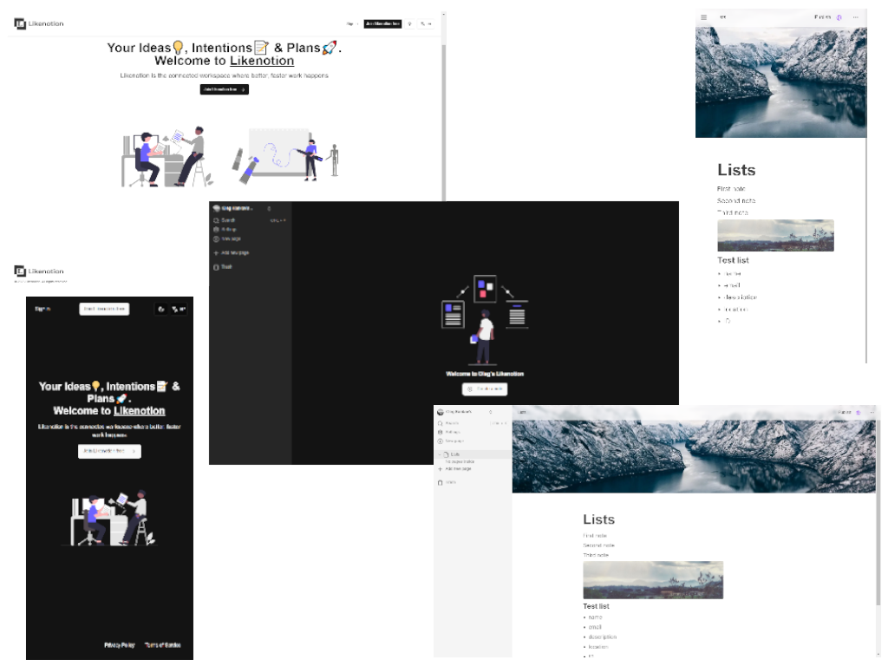

# Likenotion

This project is a simplified clone of the popular productivity application, Notion. It's designed to replicate some of the core features of Notion, providing a platform where users can create, edit, and organize their notes in a flexible and intuitive interface.

## Technologies

<!--  -->


## Getting Started

1. Clone the repository
2. Install the dependencies

```
npm install
```

3. Set up the environment variables

```
# Deployment used by `npx convex dev`
CONVEX_DEPLOYMENT=
NEXT_PUBLIC_CONVEX_URL=

NEXT_PUBLIC_CLERK_PUBLISHABLE_KEY=
CLERK_SECRET_KEY=

EDGE_STORE_ACCESS_KEY=
EDGE_STORE_SECRET_KEY=
```

4. Run Convex

```
npx convex dev
```

5. Run the development server

```
npm run dev
```

### Screenshot

<div align="center">
    <p style="width: 500px;">
        <a href="https://github.com/bakna2t/likenotion" target="_blank" >
            
        </a>
    </p>
</div>
